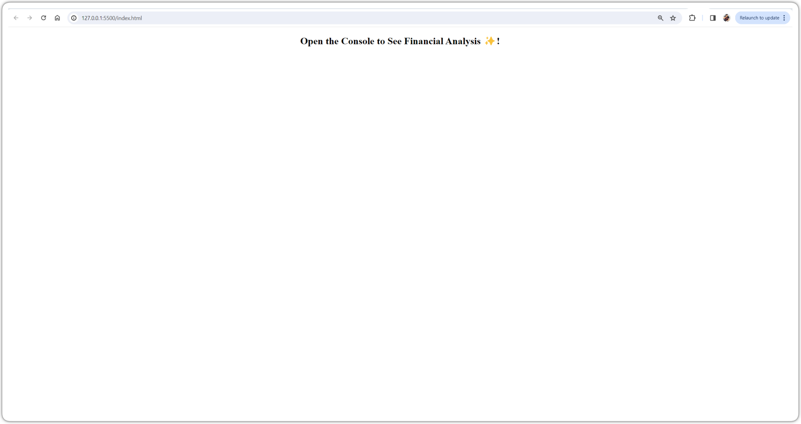
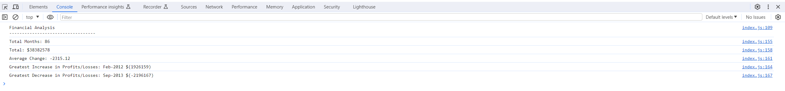
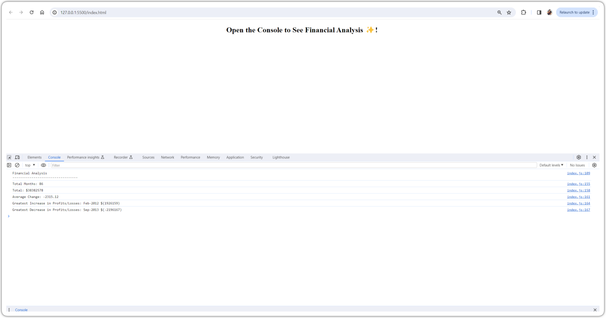

# Console-Finances Challenge

## Overview

In this challenge, we'll be using the concepts we've learned to complete the required activity. This activity presents a real-world situation in which our newfound JavaScript skills will come in handy. We are tasked with creating code for analyzing the financial records of a company.

## Instructions

We have been given a dataset composed of arrays with two fields, Date and Profit/Losses.

Our task is to write JavaScript code that analyzes the records to calculate each of the following:

* The total number of months included in the dataset.

* The net total amount of Profit/Losses over the entire period.

* The average of the **changes** in Profit/Losses over the entire period.
  * You will need to track what the total change in Profit/Losses are from month to month and then find the average.
  * (`Total/(Number of months - 1)`)

* The greatest increase in Profit/Losses (date and amount) over the entire period.

* The greatest decrease in Profit/Losses (date and amount) over the entire period.

When we open the code in the browser, resulting analysis should look similar to the following:

  ```text
  Financial Analysis 
  ----------------
  Total Months: 86
  Total: $38382578
  Average Change: -2315.12
  Greatest Increase in Profits/Losses: Feb-2012 ($1926159)
  Greatest Decrease in Profits/Losses: Sep-2013 ($-2196167)
  ```

 Final code should print the analysis to the console.


## Final Screens

Main Page : 

Result Console : 

Complete page with console result: 


## Git Hub page - 

## deployed site page - 

